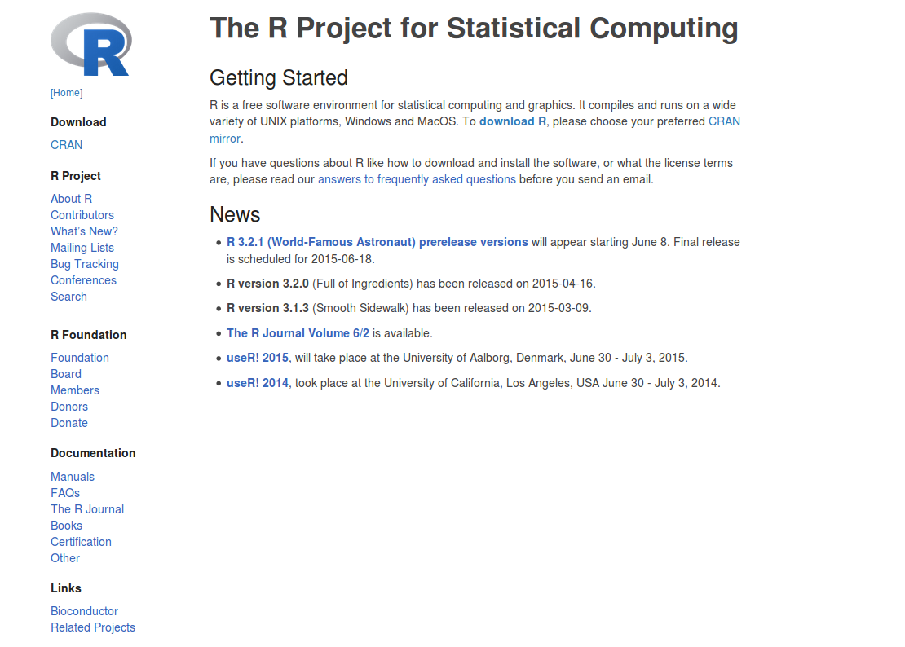
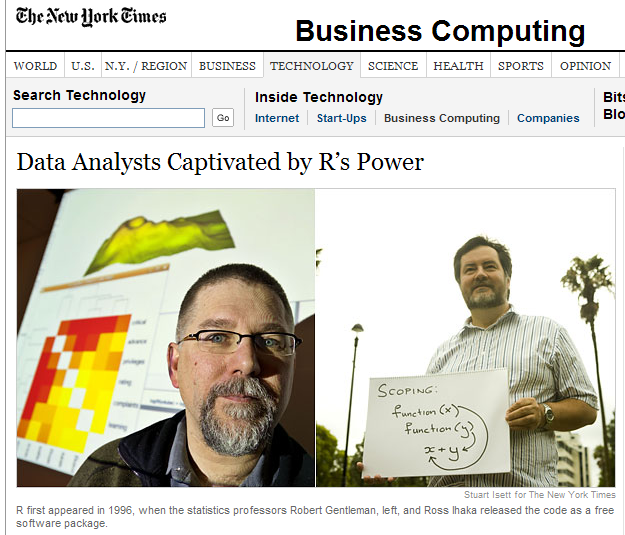

```{r setup, include=FALSE}
knitr::opts_chunk$set(echo = TRUE)
```

### Aim { .session-start }
* What is R
* Why use R
* Who use R
* Getting Started with R

# What is R?

* A statistical programming environment
    + based on 'S'
    + suited to high-level data analysis
* But offers much more than just statistics
* Open source and cross platform
* Extensive graphics capabilities
* Diverse range of add-on packages
* Active community of developers
* Thorough documentation

http://www.r-project.org/





# Why R?

We can do lot of stuffs in R. Starting from statestical analysis to plotting graphs and figures, Writing technical documentation to making a website and lot more. Lets explore.

# R plotting capabilities

https://www.facebook.com/notes/facebook-engineering/visualizing-friendships/469716398919


# Who uses R? Not just academics!

http://www.revolutionanalytics.com/companies-using-r

- Facebook
    + http://blog.revolutionanalytics.com/2010/12/analysis-of-facebook-status-updates.html
- Google
    + http://blog.revolutionanalytics.com/2009/05/google-using-r-to-analyze-effectiveness-of-tv-ads.html
- Microsoft
    + http://blog.revolutionanalytics.com/2014/05/microsoft-uses-r-for-xbox-matchmaking.html
- New York Times
    + http://blog.revolutionanalytics.com/2011/03/how-the-new-york-times-uses-r-for-data-visualization.html
- Buzzfeed
    + http://blog.revolutionanalytics.com/2015/12/buzzfeed-uses-r-for-data-journalism.html
- New Zealand Tourist Board
    + https://mbienz.shinyapps.io/tourism_dashboard_prod/

    
# R can facilitate Reproducible Research


- Statisticians at MD Anderson tried to reproduce results from a Duke paper and unintentionally unravelled a web of incompetence and skullduggery
    + as reported in the ***New York Times***
    


- Very entertaining talk from Keith Baggerly in Cambridge, December 2010

<iframe width="560" height="315" src="https://www.youtube.com/embed/7gYIs7uYbMo" frameborder="0" allowfullscreen></iframe>

According to recent editorials, the reproducibility crisis is still on-going


[Reality check on reproducibility](http://www.nature.com/news/reality-check-on-reproducibility-1.19961)

[1,500 scientists lift the lid on reproducibility](http://www.nature.com/news/1-500-scientists-lift-the-lid-on-reproducibility-1.19970)


# Getting started

R can be done/executed using command line, or a graphical user interface (GUI). On this course, we use the RStudio GUI. Lets download required files and install. 

1. Get latest version of R from [CRAN](https://cran.r-project.org/)
    + This will come will some base packages installed for general tasks.
    + We can also download additional required packages from CRAN for specific tasks, Currently `r length(XML:::readHTMLTable("http://cran.r-project.org/web/packages/available_packages_by_date.html")[[1]][[2]])` available packages as of `r date()`
2. Download RStudio from [here](https://www.rstudio.com/products/rstudio/download/#download)
    

To launch RStudio, find the RStudio icon and click


### Key Points { .session-end }
* Vast Graphics control in R
* Reproducibility can done with R

### Aim { .session-start }
* Understanding Basic Data Types and Data Structures in R

#
#

## Data Type

To make the best of the R language, you'll need a strong understanding of the
basic data types and data structures and how to operate on them.

Data structures are very important to understand because these are the objects you 
will manipulate on a day-to-day basis in R. Dealing with object conversions is one
of the most common sources of frustration for beginners.

**Everything** in R is an object.

R has 6 basic data types. (In addition to the five listed below, there is also
*raw* which will not be discussed in this session.)

* character
* numeric (real or decimal)
* integer
* logical
* complex

Elements of these data types may be combined to form data structures, such as
atomic vectors. When we call a vector *atomic*, we mean that the vector only 
holds data of a single data type. Below are examples of atomic character vectors,
numeric vectors, integer vectors, etc.

* **character**: `"a"`, `"swc"`
* **numeric**: `2`, `15.5`
* **integer**: `2L` (the `L` tells R to store this as an integer)
* **logical**: `TRUE`, `FALSE`
* **complex**: `1+4i` (complex numbers with real and imaginary parts)

R provides many functions to examine features of vectors and other objects, for
example

* `class()` - what kind of object is it (high-level)?
* `typeof()` - what is the object's data type (low-level)?
* `length()` - how long is it? What about two dimensional objects?
* `attributes()` - does it have any metadata?

```{r}
# Example
x <- "biology"
typeof(x)
attributes(x)
y <- 1:10
y
typeof(y)
length(y)
z <- as.numeric(y)
z
typeof(z)
```

## Data Structure

R has many __data structures__. These include

* atomic vector
* list
* matrix
* data frame
* factors

### Vectors

A vector is the most common and basic data structure in R and is pretty much the
workhorse of R. Technically, vectors can be one of two types:

* atomic vectors
* lists

although the term "vector" most commonly refers to the atomic types not to lists.

#### The Different Vector Modes

A vector is a collection of elements that are most commonly of mode `character`,
`logical`, `integer` or `numeric`.

You can create an empty vector with `vector()`. (By default the mode is
`logical`. You can be more explicit as shown in the examples below.) It is more
common to use direct constructors such as `character()`, `numeric()`, etc.

```{r}
vector() # an empty 'logical' (the default) vector
vector("character", length = 5) # a vector of mode 'character' with 5 elements
character(5) # the same thing, but using the constructor directly
numeric(5)   # a numeric vector with 5 elements
logical(5)   # a logical vector with 5 elements
```

You can also create vectors by directly specifying their content. R will then
guess the appropriate mode of storage for the vector. For instance:

```{r}
x <- c(1, 2, 3)
```

will create a vector `x` of mode `numeric`. These are the most common kind, and
are treated as double precision real numbers. If you wanted to explicitly create
integers, you need to add an `L` to each element (or *coerce* to the integer
type using `as.integer()`).

```{r}
x1 <- c(1L, 2L, 3L)
```

Using `TRUE` and `FALSE` will create a vector of mode `logical`:

```{r}
y <- c(TRUE, TRUE, FALSE, FALSE)
```

While using quoted text will create a vector of mode `character`:

```{r}
z <- c("Sarah", "Tracy", "Jon")
```

#### Examining Vectors

The functions `typeof()`, `length()`, `class()` and `str()` provide useful
information about your vectors and R objects in general.

```{r}
typeof(z)
length(z)
class(z)
str(z)
```

#### Adding Elements

The function `c()` (for combine) can also be used to add elements to a vector.

```{r}
z <- c(z, "Annette")
z
z <- c("Greg", z)
z
```

#### Vectors from a Sequence of Numbers

You can create vectors as a sequence of numbers.

```{r}
series <- 1:10
seq(10)
seq(from = 1, to = 10, by = 0.1)
```

#### Missing Data

R supports missing data in vectors. They are represented as `NA` (Not Available)
and can be used for all the vector types covered in this lesson:

```{r}
x <- c(0.5, NA, 0.7)
x <- c(TRUE, FALSE, NA)
x <- c("a", NA, "c", "d", "e")
x <- c(1+5i, 2-3i, NA)
```

The function `is.na()` indicates the elements of the vectors that represent
missing data, and the function `anyNA()` returns `TRUE` if the vector contains
any missing values:

```{r}
x <- c("a", NA, "c", "d", NA)
y <- c("a", "b", "c", "d", "e")
is.na(x)
is.na(y)
anyNA(x)
anyNA(y)
```

#### Other Special Values

`Inf` is infinity. You can have either positive or negative infinity.

```{r}
1/0
```

`NaN` means Not a Number. It's an undefined value.

```{r}
0/0
```

#### What Happens When You Mix Types Inside a Vector?

R will create a resulting vector with a mode that can most easily accommodate
all the elements it contains. This conversion between modes of storage is called
"coercion". When R converts the mode of storage based on its content, it is
referred to as "implicit coercion". For instance, can you guess what the
following do (without running them first)?

```{r}
xx <- c(1.7, "a")
xx <- c(TRUE, 2)
xx <- c("a", TRUE)
```

You can also control how vectors are coerced explicitly using the
`as.<class_name>()` functions:

```{r}
as.numeric("1")
as.character(1:2)
```

> **Finding Commonalities**
>
> Do you see a property that's common to all these vectors above?
> 
> > **Solution**  
> > All vectors are one-dimensional and each element is of the same type.

#### Objects Attributes

Objects can have __attributes__. Attributes are part of the object. These include:

* names
* dimnames
* dim
* class
* attributes (contain metadata)

You can also glean other attribute-like information such as length (works on
vectors and lists) or number of characters (for character strings).

```{r}
length(1:10)
nchar("Software Carpentry")
```

### Matrix

In R matrices are an extension of the numeric or character vectors. They are not
a separate type of object but simply an atomic vector with dimensions; the
number of rows and columns. As with atomic vectors, the elements of a matrix must
be of the same data type.

```{r}
m <- matrix(nrow = 2, ncol = 2)
m
dim(m)
```

You can check that matrices are vectors with a class attribute of `matrix` by using
`class()` and `typeof()`.

```{r}
m <- matrix(c(1:3))
class(m)
typeof(m)
```

While `class()` shows that m is a matrix, `typeof()` shows that fundamentally the
matrix is an integer vector.

> **Data types of matrix elements **
> 
> Consider the following matrix:
> 
> ```{r matrix-typeof}
> FOURS <- matrix(
>   c(4, 4, 4, 4),
>   nrow = 2,
>   ncol = 2)
> ```
>
> Given that `typeof(FOURS[1])` returns `"double"`, what would you expect
> `typeof(FOURS)` to return? How do you know this is the case even without
> running this code?
>
> *Hint* Can matrices be composed of elements of different data types?
> 
> > **Solution**  
> > We know that `typeof(FOURS)` will also return `"double"` since matrices 
> > are made of elements of the same data type. Note that you could do 
> > something like `as.character(FOURS)` if you needed the elements of `FOURS` 
> > *as characters*.
> 

Matrices in R are filled column-wise.

```{r}
m <- matrix(1:6, nrow = 2, ncol = 3)
```

Other ways to construct a matrix

```{r}
m      <- 1:10
dim(m) <- c(2, 5)
```

This takes a vector and transforms it into a matrix with 2 rows and 5 columns.

Another way is to bind columns or rows using `rbind()` and `cbind()` ("row bind"
and "column bind", respectively).

```{r}
x <- 1:3
y <- 10:12
cbind(x, y)
rbind(x, y)
```

You can also use the `byrow` argument to specify how the matrix is filled.
From R's own documentation:

```{r}
mdat <- matrix(c(1, 2, 3, 11, 12, 13),
               nrow = 2,
               ncol = 3,
               byrow = TRUE)
mdat
```

Elements of a matrix can be referenced by specifying the index along each
dimension (e.g. "row" and "column") in single square brackets.

```{r}
mdat[2, 3]
```

### List

In R lists act as containers. Unlike atomic vectors, the contents of a list are
not restricted to a single mode and can encompass any mixture of data
types. Lists are sometimes called generic vectors, because the elements of a
list can by of any type of R object, even lists containing further lists. This
property makes them fundamentally different from atomic vectors.

A list is a special type of vector. Each element can be a different type.

Create lists using `list()` or coerce other objects using `as.list()`. An empty
list of the required length can be created using `vector()`

```{r}
x <- list(1, "a", TRUE, 1+4i)
x
x <- vector("list", length = 5) # empty list
length(x)
```

The content of elements of a list can be retrieved by using double square brackets.

```{r}
x[[1]]
```

Vectors can be coerced to lists as follows:

```{r}
x <- 1:10
x <- as.list(x)
length(x)
```

> **Examining Lists **
>
> 1. What is the class of `x[1]`?
> 2. What is the class of `x[[1]]`?
> 
> > **Solution**    
> > 1. 
> >     ```{r examine-lists-1}
> >     class(x[1])
> >     ```
> > 2. 
> >     ```{r examine-lists-2}
> >     class(x[[1]])
> >     ```

Elements of a list can be named (i.e. lists can have the `names` attribute)

```{r}
xlist <- list(a = "Karthik Ram", b = 1:10, data = head(iris))
xlist
names(xlist)
```

> **Examining Named Lists **
>
> 1. What is the length of this object?
> 2. What is its structure?
> 
> > **Solution**    
> > 1. 
> >     ```{r examine-named-lists-1}
> >     length(xlist)
> >     ```
> > 2. 
> >     ```{r examine-named-lists-2}
> >     str(xlist)
> >     ```
> {: .solution}
{: .challenge} 
Lists can be extremely useful inside functions. Because the functions in R are 
able to return only a single object, you can "staple" together lots of different
kinds of results into a single object that a function can return.

A list does not print to the console like a vector. Instead, each element of the
list starts on a new line.

Elements are indexed by double brackets. Single brackets will still return
another list. If the elements of a list are named, they can be referenced by
the `$` notation (i.e. `xlist$data`).


### Data Frame

A data frame is a very important data type in R. It's pretty much the *de facto*
data structure for most tabular data and what we use for statistics.

A data frame is a *special type of list* where every element of the list has same
length (i.e. data frame is a "rectangular" list).

Data frames can have additional attributes such as `rownames()`, which can be
useful for annotating data, like `subject_id` or `sample_id`. But most of the
time they are not used.

Some additional information on data frames:

* Usually created by `read.csv()` and `read.table()`, i.e. when importing the data into R.
* Assuming all columns in a data frame are of same type, data frame can be converted to a matrix with data.matrix() (preferred) or as.matrix(). Otherwise type coercion will be enforced and the results may not always be what you expect.
* Can also create a new data frame with `data.frame()` function.
* Find the number of rows and columns with `nrow(dat)` and `ncol(dat)`, respectively.
* Rownames are often automatically generated and look like 1, 2, ..., n. Consistency in numbering of rownames may not be honored when rows are reshuffled or subset.

#### Creating Data Frames by Hand

To create data frames by hand:

```{r}
dat <- data.frame(id = letters[1:10], x = 1:10, y = 11:20)
dat
```

> **Useful Data Frame Functions **
> 
> * `head()` - shows first 6 rows
> * `tail()` - shows last 6 rows
> * `dim()` - returns the dimensions of data frame (i.e. number of rows and number of columns)
> * `nrow()` - number of rows
> * `ncol()` - number of columns
> * `str()` - structure of data frame - name, type and preview of data in each column
> * `names()` or `colnames()` - both show the `names` attribute for a data frame
> * `sapply(dataframe, class)` - shows the class of each column in the data frame
{: .callout}
See that it is actually a special list:

```{r}
is.list(dat)
class(dat)
```

Because data frames are rectangular, elements of data frame can be referenced by specifying 
the row and the column index in single square brackets (similar to matrix).

```{r}
dat[1, 3]
```

As data frames are also lists, it is possible to refer to columns (which are elements of
such list) using the list notation, i.e. either double square brackets or a `$`.

```{r}
dat[["y"]]
dat$y
```

The following table summarizes the one-dimensional and two-dimensional data structures in 
R in relation to diversity of data types they can contain.

| Dimensions | Homogenous | Heterogeneous |
| ------- | ---- | ---- |
| 1-D | atomic vector | list |
| 2-D | matrix | data frame |

> Lists can contain elements that are themselves muti-dimensional (e.g. a lists can contain
> data frames or another type of objects). Lists can also contain elements of any length,
> therefore list do not necessarily have to be "rectangular". However in order for the list
> to qualify as a data frame, the length of each element has to be the same. 
{: .callout}
> **Column Types in Data Frames **
>
> Knowing that data frames are lists, can columns be of different type?
>
> What type of structure do you expect to see when you explore the structure of the `iris` data frame? Hint: Use `str()`.
> 
> > **Solution**    
> > The Sepal.Length, Sepal.Width, Petal.Length and Petal.Width columns are all
> > numeric types, while Species is a Factor.
> > Lists can have elements of different types.
> > Since a Data Frame is just a special type of list, it can have columns of
> > differing type (although, remember that type must be consistent within each column!).
> > ```{r column-types}
> > str(iris)
> > ```

### Key Points { .session-end }
* Use `typeof()` and `class()` to know a object type and its class
* Remember `[row, column]`

### Aim { .session-start }
* Reading tabular data to R
* data analysis

#
#

## Steps to Basic Data Analysis

- In this short section, we show how the data manipulation steps we have just seen can be used as part of an analysis pipeline:

1. Reading in data
    + `read.table()`
    + `read.csv(), read.delim()`
2. Analysis
    + Manipulating & reshaping the data
        + perhaps dealing with "missing data"
    + Any maths you like
    + Diagnostic Plots
3. Writing out results
    + `write.table()`
    + `write.csv()`
  
## A simple walk-through

- We have data from 100 patients that given consent for their data to use in future studies
- A researcher wants to undertake a study involving people that are overweight
- We will walk-through how to filter the data and write a new file with the candidates for the study    
    
## The Working Directory (wd)


- Like many programs R has a concept of a working directory 
- It is the place where R will look for files to execute and where it will
save files, by default
- For this course we need to set the working directory to the location
of the course scripts
- In R Studio use the mouse and browse to the directory where you saved the Course Materials

- ***Session → Set Working Directory → Choose Directory...***

## Locate the data

Before we even start the analysis, we need to be sure of where the data are located on our hard drive

- Functions that import data need a file location as a character vector
- The default location is the ***working directory***
```{r}
getwd()
```

- If the file you want to read is in your working directory, you can just use the file name

```{r eval=FALSE}
list.files()
```

- The `file.exists` function does exactly what it says on the tin!
    + a good sanity check for your code

```{r}
file.exists("data/patient-info.txt")
```

- Otherwise you need the *path* to the file
    + you can get this using **`file.choose()`**
    
- If you unsure about specifying a file path at the command line, this [online tutorial](http://rik.smith-unna.com/command_line_bootcamp/?id=vczhybjhtyt) will give you hands-on practice
    
## Read in the data

- The data are a tab-delimited file. Each row is a record, each column is a field. Columns are separated by tabs in the text
- We need to read in the results and assign it to an object (`patients`)

```{r}
patients <- read.delim("data/patient-info.txt")
```

In the latest RStudio, there is the option to import data directly from the File menu. ***File*** -> ***Import Dataset*** -> ***From Csv***

- If the data are comma-separated, then use either the argument `sep=","` or the function `read.csv()`:
- You need to make sure you use the correct function
    + can you explain the output of the following lines of code?

```{r }
tmp <- read.csv("data/patient-info.txt")
head(tmp)
```

- For full list of arguments:
```{r, eval=FALSE}
?read.table
```

## Check the data
- *Always* check the object to make sure the contents and dimensions are as you expect
- R will sometimes create the object without error, but the contents may be un-usable for analysis
    + If you specify an incorrect separator, R will not be able to locate the columns in your data, and you may end up with an object with just one column
    
```{r}
# View the first 10 rows to ensure import is OK
patients[1:10,]  
```


- or use the `View()` function to get a display of the data in RStudio:
```{r, eval=FALSE}
View(patients)
```

## Understanding the object

- Once we have read the data successfully, we can start to interact with it
- The object we have created is a *data frame*:
```{r}
class(patients)
```

- We can query the dimensions:

```{r}
ncol(patients)
nrow(patients)
dim(patients)
```


- The names of the columns are automatically assigned:

```{r}
colnames(patients)
```

- We can use any of these names to access a particular column:
    + and create a vector
    + TOP TIP: type the name of the object and hit TAB: you can select the column from the drop-down list!
```{r}
patients$ID
```

## Word of warning


> Like families, tidy datasets are all alike but every messy dataset is messy in its own way - (Hadley Wickham - RStudio chief scientist and author of dplyr, ggplot2 and others)
You will make your life a lot easier if you keep your data **tidy** and ***organised***. Before blaming R, consider if your data are in a suitable form for analysis. The more manual manipulation you have done on the data (highlighting, formulas, copy-and-pasting), the less happy R is going to be to read it. Here are some useful links on some common pitfalls and how to avoid them

- http://www.datacarpentry.org/spreadsheet-ecology-lesson/
- http://kbroman.org/dataorg/

## Handling missing values

- The data frame contains some **`NA`** values, which means the values are missing – a common occurrence in real data collection
- `NA` is a special value that can be present in objects of any type (logical, character, numeric etc)
- `NA` is not the same as `NULL`:
    - `NULL` is an empty R object. 
    - `NA` is one missing value within an R object (like a data frame or a vector)
- Often R functions will handle `NA`s gracefully:

```{r}
length(patients$Height)
mean(patients$Height)
```

- However, sometimes we have to tell the functions what to do with them. 
- R has some built-in functions for dealing with `NA`s, and functions often have their own arguments (like `na.rm`) for handling them:
    + annoyingly, different functions have different argument names to change their behavior with regards to `NA` values. *Always check the documentation*

```{r}
mean(patients$Height, na.rm = TRUE)
mean(na.omit(patients$Height))
```

## Analysis

- Our analysis involves identifying patients with extreme BMI
    + we will define this as being two standard deviations from the mean

```{r}
# Create an index of results:
BMI <- (patients$Weight)/((patients$Height/100)^2)
upper.limit <- mean(BMI,na.rm = TRUE) + 2*sd(BMI,na.rm = TRUE)
upper.limit
```


- We can plot a simple chart of the BMI values 
    + add a vertical line to indicate the cut-off
    + plotting will be covered in detail shortly..

```{r}
plot(BMI)
# Add a horizonal line:
abline(h=upper.limit) 
```

- It is also useful to save the variable we have computed as a new column in the data frame

```{r}
round(BMI,1)
patients$BMI <- round(BMI,1)
head(patients)
```

- To actually select the candidates we can use a logical expression to test the values of the BMI vector being greater than the upper limit
    + if the second line looks a bit weird, remember that `<-` is doing an assignment. The value we are assigning to our new variable is the logical (`TRUE` or `FALSE`) vector given by testing each item in `BMI` against the `upper.limit`
    
```{r}
BMI > upper.limit
candidates <- BMI > upper.limit
```

We have seen that a logical vector can be used to subset a data frame

- However, in our case the result looks a bit funny
- Can you think why this might be?

```{r}
patients[candidates,]
```

The `which` function will take a logical vector and return the indices of the `TRUE` values

- This can then be used to subset the data frame

```{r}
which(BMI > upper.limit)
candidates <- which(BMI > upper.limit)
```


## Outputting the results

- We write out a data frame of candidates (patients with BMI more than standard deviations from the mean) as a 'comma separated values' text file (CSV):

```{r}
write.csv(patients[candidates,], file="outputs/selectedSamples.csv")
```

- The output file is directly-readable by Excel
- It's often helpful to double check where the data has been saved. Use the *get working directory* function:

```{r eval=FALSE}
getwd()      # print working directory
list.files() # list files in working directory
```


To recap, the set of R commands we have used is:-

```{r}
patients <- read.delim("data/patient-info.txt")
BMI <- (patients$Weight)/((patients$Height/100)^2)
upper.limit <- mean(BMI,na.rm = TRUE) + 2*sd(BMI,na.rm = TRUE)
plot(BMI)
# Add a horizonal line:
abline(h=upper.limit) 
patients$BMI <- round(BMI,1)
candidates <- which(BMI > upper.limit)
write.csv(patients[candidates,], file="outputs/selectedSamples.csv")
```

## Exercise: Exercise 3

- A separate study is looking for patients that are underweight and also smoke; 
  + Modify the condition in our previous code to find these patients
  + e.g. having BMI that is 2 standard deviations *less* than the mean BMI
  + Write out a results file of the samples that match these criteria, and open it in a spreadsheet program

### Key Points { .session-end }
* Import data using `read.table()`