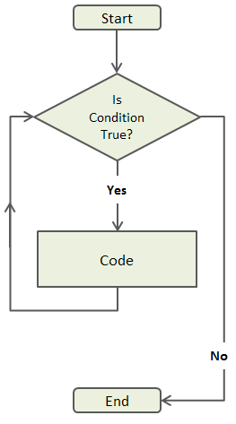

```{r setup, include=FALSE}
knitr::opts_chunk$set(echo = TRUE)
```

### Aim { .session-start }
* Learn Programing in R

#
#

## Programming in R

Till this moment we were calling each built-in function and executing mostly in single lines.
Now Let's do some reals programming, which will include:

  * Conditional Statements
  * Looping
  * Functions

### Conditional Statements

Sometimes we needs to take decisions based on condition(s).

In programming languages for doing this is called a conditional statement, and looks like this:

```{r, results='hold'}
num <- 37
if (num > 100) {
  print("greater")
} else {
  print("not greater")
}
print("done")
```

The second line of this code uses an `if` statement to tell R that we want to make a choice.
If the following test is true, the body of the `if` (i.e., the lines in the curly braces underneath it) are executed.
If the test is false, the body of the `else` is executed instead.
Only one or the other is ever executed:


In the example above, the test `num > 100` returns the value `FALSE`, which is why the code inside the `if` block was skipped and the code inside the `else` statement was run instead.

```{r}
num > 100
```

And as you likely guessed, the opposite of `FALSE` is `TRUE`.

```{r}
num < 100
```

Conditional statements don't have to include an `else`.
If there isn't one, R simply does nothing if the test is false:

```{r}
num <- 53
if (num < 100) {
  print("num is less than 100")
}
```

<div class = "exercise fold s o">
**Exercise-1**

Write a if-else condition statement to find if a number is even or odd.

**Solution**
```{r}
num <- 34
if(num%%2 == 0){
  print("Number is even")
} else {
  print("Number is odd")
}
```
</div>

#####

<div class = "exercise fold s o">
**Exercise-2**

Write a if-else condition statement to find if a number is positive.

**Solution**
```{r}
x <- 5
if(x > 0){
print("Positive number")
}
```
</div>

#####

> **Note**  
>
The test for equality uses two equal signs, `==`.
Other tests include greater than or equal to (`>=`), less than or equal to (`<=`), and not equal to (`!=`).
We can also combine tests. Two ampersands, `&&`, symbolize "and". Two vertical bars, `||`, symbolize "or". `&&` is only true if both parts are true.
  

```{r}
if (1 > 0 && -1 > 0) {
    print("both parts are true")
} else {
  print("at least one part is not true")
}
```

while `||` is true if either part is true:

```{r}
if (1 > 0 || -1 > 0) {
    print("at least one part is true")
} else {
  print("neither part is true")
}
```

In this case, "either" means "either or both", not "either one or the other but not both".

### Looping

In computer programming, a loop is a sequence of instructions that is continually repeated until a certain condition is reached.



- R has two basic types of loop
    + a **`for`** loop: run some code on every value in a vector
    + a **`while`** loop: run some code while some condition is true (*hardly ever used!*)
    
#### `for` 

```{r eval=FALSE}
for(i in 1:10) {
  print(i)
  }
```

#### `while`

```{r eval=FALSE}
i <- 1
while(i <= 10 ) {
  print(i)
  i <- i + 1
  }
```

<div class = "exercise fold s o">
**Exercise-1**

Write a for loop to sum all numbers in between 1 to 10.

**Solution**
```{r}
sum <- 0 # initialize sum is zero
for(n in 1:10){
  sum <- sum + n
}
print(sum)
```
</div>

#####

<div class = "exercise fold s o">
**Exercise-2**

Write program to check if the input number is prime or not take input from the user

**Solution**
```{r}
#num = as.integer(readline(prompt="Enter a number: "))
num = 7
flag = 0
# prime numbers are greater than 1
if(num > 1) {
  # check for factors
  flag = 1
  for(i in 2:(num-1)) {
    if ((num %% i) == 0) {
      flag = 0
      break
    }
  }
} 
if(num == 2)    flag = 1
if(flag == 1) {
  print(paste(num,"is a prime number"))
} else {
  print(paste(num,"is not a prime number"))
}
```
</div>

#####

### Functions

If we only had one data set to analyze, it would probably be faster to load the file into a spreadsheet and use that to plot some simple statistics.
But we have twelve files to check, and may have more in the future.
In this lesson, we'll learn how to write a function so that we can repeat several operations with a single command.

#### Defining a Function

Let's start by defining a function `fahrenheit_to_kelvin` that converts temperatures from Fahrenheit to Kelvin:

```{r}
fahrenheit_to_kelvin <- function(temp_F) {
  temp_K <- ((temp_F - 32) * (5 / 9)) + 273.15
  return(temp_K)
}
```

We define `fahrenheit_to_kelvin` by assigning it to the output of `function`.
The list of argument names are contained within parentheses.
Next, the body of the function--the statements that are executed when it runs--is contained within curly braces (`{}`).
The statements in the body are indented by two spaces, which makes the code easier to read but does not affect how the code operates.

When we call the function, the values we pass to it are assigned to those variables so that we can use them inside the function.
Inside the function, we use a return statement to send a result back to whoever asked for it.


> **Automatic Returns**
>
In R, it is not necessary to include the return statement.
R automatically returns whichever variable is on the last line of the body
of the function. While in the learning phase, we will explicitly define the
return statement.

Let's try running our function.
Calling our own function is no different from calling any other function:

```{r}
# freezing point of water
fahrenheit_to_kelvin(32)
# boiling point of water
fahrenheit_to_kelvin(212)
```

We've successfully called the function that we defined, and we have access to the value that we returned.

#### Composing Functions

Now that we've seen how to turn Fahrenheit into Kelvin, it's easy to turn Kelvin into Celsius:

```{r}
kelvin_to_celsius <- function(temp_K) {
  temp_C <- temp_K - 273.15
  return(temp_C)
}
# absolute zero in Celsius
kelvin_to_celsius(0)
```

What about converting Fahrenheit to Celsius?
We could write out the formula, but we don't need to.
Instead, we can compose the two functions we have already created:

```{r}
fahrenheit_to_celsius <- function(temp_F) {
  temp_K <- fahrenheit_to_kelvin(temp_F)
  temp_C <- kelvin_to_celsius(temp_K)
  return(temp_C)
}
# freezing point of water in Celsius
fahrenheit_to_celsius(32.0)
```

This is our first taste of how larger programs are built: we define basic
operations, then combine them in ever-larger chunks to get the effect we want.
Real-life functions will usually be larger than the ones shown here--typically half a dozen to a few dozen lines--but they shouldn't ever be much longer than that, or the next person who reads it won't be able to understand what's going on.

> **Nesting Functions**
>
This example showed the output of `fahrenheit_to_kelvin` assigned to `temp_K`, which
is then passed to `kelvin_to_celsius` to get the final result. It is also possible
to perform this calculation in one line of code, by "nesting" one function
inside another, like so
```{r chained-example}
# freezing point of water in Celsius
kelvin_to_celsius(fahrenheit_to_kelvin(32.0))
```

<div class = "exercise fold s o">
**Exercise**

In the last lesson, we learned to combine elements into a vector using the `c` function,
e.g. `x <- c("A", "B", "C")` creates a vector `x` with three elements.
Furthermore, we can extend that vector again using `c`, e.g. `y <- c(x, "D")` creates a vector `y` with four elements.
Write a function called `highlight` that takes two vectors as arguments, called
`content` and `wrapper`, and returns a new vector that has the wrapper vector
at the beginning and end of the content:

**Solution**
```{r}
highlight <- function(content, wrapper) {
  answer <- c(wrapper, content, wrapper)
  return(answer)
}
best_practice <- c("Write", "programs", "for", "people", "not", "computers")
asterisk <- "***"  # R interprets a variable with a single value as a vector
                    # with one element.
highlight(best_practice, asterisk)
```
</div>

#####

<div class = "exercise fold s o">
**Exercise**

If the variable `v` refers to a vector, then `v[1]` is the vector's first element and `v[length(v)]` is its last (the function `length` returns the number of elements in a vector).
Write a function called `edges` that returns a vector made up of just the first and last elements of its input:

**Solution**
```{r}
edges <- function(v) {
   first <- v[1]
    last <- v[length(v)]
    answer <- c(first, last)
    return(answer)
 }
dry_principle <- c("Don't", "repeat", "yourself", "or", "others")
edges(dry_principle)
```
</div>

#####

### Key Points { .session-end }
* Divide a program into small chunks of functions for easy interpretability. 

### Aim { .session-start }
* Learn about packages in R
* Use Bioconductor

#
#

## Packages

Packages are collection of several functions in R.

To use a perticular function from a package, it need to be downloaded and loaded.

### Install a package from CRAN
```{r, eval=FALSE}
# download and install 'ggplot2' package from CRAN
install.packages("ggplot2")
```

### Introduction to Bioconductor
Bioconductor is a collection of more than 1,500 packages for the statistical analysis and comprehension of high-throughput genomic data. Originally developed for microarrays, Bioconductor packages are now used in a wide range of analyses, including bulk and single-cell RNA-seq, ChIP seq, copy number analysis, microarray methylation and classic expression analysis, flow cytometry, and many other domains.

This session introduces the essential of Bioconductor package discovery, installation, and use.

### Use Biocondutor
Discovering, installing, and learning how to use Bioconductor packages.

The web site at https://bioconductor.org contains descriptions of all Bioconductor packages, as well as essential reference material for all levels of user.

### Install from Bioconductor
```{r, eval=FALSE}
install.packages("BiocManager")
BiocManager::install(c("rtracklayer", "GenomicRanges"))
```

## Usecase
Lets see how to do diffrential expression analysis using Biocondutor package called `DESeq2`

Get the required files using `wget` in terminal.
```{bash, eval=FALSE}
# RAW Read Count Matrix
wget https://raw.githubusercontent.com/sk-sahu/learn-R/master/data/airway_count_matrix.txt
# Meta Data
wget https://raw.githubusercontent.com/sk-sahu/learn-R/master/data/airway_metadata.txt
```

This above is derived from Bioconductor experimental data [`airway` package](https://bioconductor.org/packages/release/data/experiment/html/airway.html). Which is a part [this](http://www.ncbi.nlm.nih.gov/pubmed/24926665) publication.

General commands to run DESeq2
```{r, eval=FALSE}
# Install DESeq2
BiocManager::install("DESeq2")
# Set Working Directory
setwd("your/working/dir/path")
# Import data
count_data <- read.table("reads_counts_matrix.txt", header = TRUE, row.names = 1)
metadata <- read.table("metadata.txt", header = TRUE, row.names = 1)
# Check data
all(rownames(metadata) == colnames(count_data))
# Built DESeq Object
dds <- DESeqDataSetFromMatrix(countData = count_data,
                              colData = metadata,
                              design = ~ conditions)
# Filter low reads counts
keep <- rowSums(counts(dds)) >= 10
dds <- dds[keep,]
# Run Diffrential Analysis
dds <- DESeq(dds, parallel = FALSE)
# Results
res <- results(dds)
# Visulaize Results
plotMA(res)
abline(h=c(-1,1), col="dodgerblue", lwd=2)
# filter only significant genes (padj <= )
res_sig <- subset(res, padj <= 0.05)
# export the significant results to a file
write.csv(res_sig, "DE_results.csv")

# Normalization and Visulaization
## log-transcformation
rld <- rlog(dds)
## Box-plot
boxplot(log2(count_matrix), ylab="Log2(Read Count)", main = "Before Normalization",las=2)
boxplot(assay(rld), ylab="rlog transformation", main = "Before Normalization",las=2)
## PCA-plot
plotPCA(rld, intgroup=c("cell", "dex"))
## Expression Heatmap for 50 significant genes
sig_gene_list <- rownames(res_sig)[1:500]
heatmap(assay(rld)[sig_gene_list, ])
```

### Key Points { .session-end }
* To install packages from Biocondutor `BiocManager::install(pkg_name)`

### Aim { .session-start }
* Learning how to graph/plot in R and basic customizations.

#
#

## Graphics
One of the main reasons data analysts turn to R is for its strong graphic capabilities.

## Creating a Graph
```{r}
attach(mtcars)
plot(wt, mpg)
abline(lm(mpg~wt))
title("Regression of MPG on Weight")
```

The `plot( )` function opens a graph window and plots weight vs. miles per gallon.
The next line of code adds a regression line to this graph. The final line adds a title.

## Saving Graphs
You can save the graph in a variety of formats from the menu
File -> Save As.

You can also save the graph via code using one of the following functions.

| Function                    | Output to        |
|-----------------------------|------------------|
| pdf("mygraph.pdf")          | pdf file         |
| win.metafile("mygraph.wmf") | windows metafile |
| png("mygraph.png")          | png file         |
| jpeg("mygraph.jpg")         | jpeg file        |
| bmp("mygraph.bmp")          | bmp file         |
| postscript("mygraph.ps")    | postscript file  |

## Built-in plots functions
Few ploting functions comes built-in when R installed. These can help do diffrent type of plots. Such as
  * Scater Plots
  * Dot Plots
  * Bar Plots
  * Pie Charts
  * Box Plots
  
## Scatter Plots
```{r}
plot(wt, mpg, main="Scatterplot Example",
   xlab="Car Weight ", ylab="Miles Per Gallon ", pch=19)
```
  
### Dot Plots
```{r}
dotchart(mtcars$mpg,labels=row.names(mtcars),cex=.7,
   main="Gas Milage for Car Models",
   xlab="Miles Per Gallon")
```

### Bar Plots

#### Simple Bar Plot
```{r}
counts <- table(mtcars$gear)
barplot(counts, main="Car Distribution",
   xlab="Number of Gears")
```

#### Stacked Bar Plot
```{r}
counts <- table(mtcars$vs, mtcars$gear)
barplot(counts, main="Car Distribution by Gears and VS",
  xlab="Number of Gears", col=c("darkblue","red"),
  legend = rownames(counts))
```

#### Grouped Bar Plot
```{r}
counts <- table(mtcars$vs, mtcars$gear)
barplot(counts, main="Car Distribution by Gears and VS",
  xlab="Number of Gears", col=c("darkblue","red"),
  legend = rownames(counts), beside=TRUE)
```

### Pie Charts

```{r}
slices <- c(10, 12,4, 16, 8)
lbls <- c("US", "UK", "Australia", "Germany", "France")
pie(slices, labels = lbls, main="Pie Chart of Countries")
```

### Box Plots

#### Simple Boxplot
```{r}
boxplot(mpg~cyl,data=mtcars, main="Car Milage Data",
   xlab="Number of Cylinders", ylab="Miles Per Gallon")
```

#### Notched Boxplot
```{r}
boxplot(len~supp*dose, data=ToothGrowth, notch=TRUE,
  col=(c("gold","darkgreen")),
  main="Tooth Growth", xlab="Suppliment and Dose")
```

## Customization
Graphical parameters describes how to change a graph's symbols, fonts, colors, and lines. Axes and text describe how to customize a graph's axes, add reference lines, text annotations and a legend. Combining plots describes how to organize multiple plots into a single graph.

```{r}
# Legend Example
attach(mtcars)
boxplot(mpg~cyl, main="Milage by Car Weight",
   yaxt="n", xlab="Milage", horizontal=TRUE,
   col=terrain.colors(3))
legend("topright", inset=.05, title="Number of Cylinders",
   c("4","6","8"), fill=terrain.colors(3), horiz=TRUE)
```

## Advance Ploting
Refer the follwing link - https://www.statmethods.net/advgraphs/index.html

### Key Points { .session-end }
* Legends of any plot can be made using `legend()` just after the plot is made.